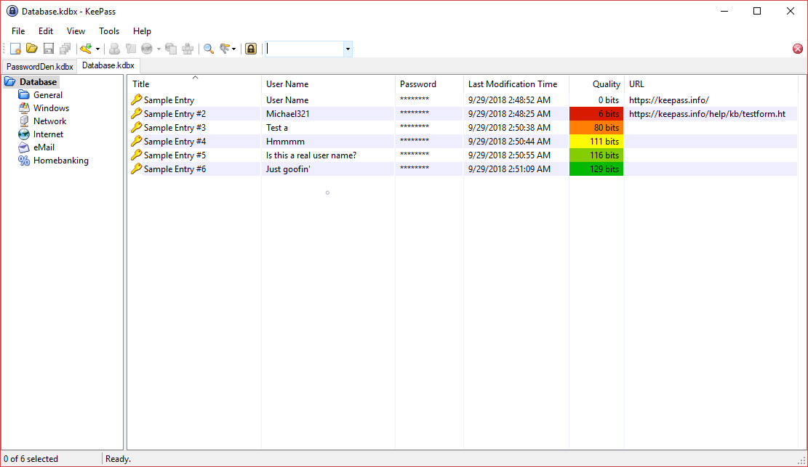

# ColoredQualityColumn
ColoredQualityColumn is a KeePass plugin that provides a new 'Quality' column that is colored based on the strength of the entry's password. It is made to make seeing how well structured your password is at a quick glance.

Quality strength values were grabbed from the [Password Quality Estimation](https://keepass.info/help/kb/pw_quality_est.html) page provided by KeePass.

# Prerequisites
* KeePass 2.x

# Building
* See https://keepass.info/help/v2_dev/plg_index.html#plgx

# Thanks
* Dominik Reichl for not only developing KeePass, but the [QualityColumn](https://keepass.info/plugins.html#qcol) plugin as well. That plugin was used as the foundation for this one.
* Scott Richter for [QualityHighlighter](https://keepass.info/plugins.html#qhl) which was used as code guidance for the coloring.